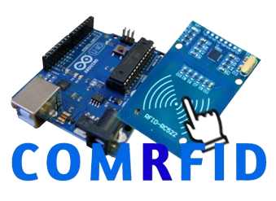

> [!IMPORTANT]  
> Criado por Guilherme Pereira Fonseca, João Vitor, Gabriel Correia.

<p style="font-size: 35px;" id="sumario">Sumário</p>

<li><a href="#o-que-é-nosso-produto">O que é nosso produto?</a></li>
<li><a href="#componentes">Componentes</a></li>
<li><a href="#programação---cc">Progrmação C/C++</a></li>
<li><a href="#bibliotecas">Bibliotecas</a></li>
<li><a href="#funções">Funções</a></li>

<br>
<center></center>

# COMRFID

## O que é nosso produto?

<p style="text-align: justify; line-height: 1.8">Nosso produto visa a automação residencial, do simples ato de ligar o computador, o diferecial vem no meio de executar tal ação. <br>
Com o Cartão RFID e o Modulo RFID, podemos ligar o mesmo com um cartão contendo sua indentificação própria, assim mantendo a segurança do cliente há acessar seu computador. <br>
Para isso irei explica da componente utilizado no nosso produto/TCC feito na <strong style="text-decoration: underline; font-family: Arial;">Etec Dr. Jose Viana Coutinho.</strong></p>

## Componentes


### Arduino

<p style="text-align: justify; line-height: 1.8;">Nosso produto utiliza para toda base o Arduino UNO R3, contendo a linguagem de programação (<em>A lógica por trás de toda ação do projeto, sendo o <strong>cérebro</strong></em>) chamada C/C++, ele fornece pinos para comunicação com restos do componentes, para isso utiliza jumpers (<em>fios de cobre que conduz eletrecidade</em>)</p>


### Cartão RFID / RFID

<p style="text-align: justify; line-height: 1.8;">Aqui acontece uma das mágicas para ligar o computador, ele terá a identificação única para acionar seu computador quando passado com o Modulo RFID.</p>


### LCD Modulo I2C

<p style="text-align: justify; line-height: 1.8;">Componente que será utilizado para informar o usuário se o acesso está "<strong>liberado</strong>" ou "<strong>negado</strong>", também poderá ver o aviso de "<strong>Ligando</strong>" e "<strong>Desligando</strong>", esse segundo so visualizado se passar o cartão com ID certo no leitor RFID.</p>


### Buzzer

<p style="text-align: justify; line-height: 1.8;">Componente que avisa o usuário se o cartão passado e tem o ID incorreto, emite um som agudo por 3 segundos.</p>

&gt; <a href="#sumario">Voltar ao topo </a>

## Programação - C/C++

<p style="text-align: justify; line-height: 1.8;">Sobre a programação utilizamos conceito básicos de <strong style="text-decoration: underline;">declaração de váriaveis, funções, bibliotecas</strong>, bibliotecas e funções falarei a frente:</p>

&gt; <a href="#sumario">Voltar ao topo </a>

## Bibliotecas

### <SPI.h>

<p style="text-align: justify; line-height: 1.8;">Permite que você comunique com dispositivos SPI (Serial Peripheral Interface) uma troca de um dispositivo mestre para um subordinado.</p>

### <Wire.h>

<p style="text-align: justify; line-height: 1.8;">Permite que seja possivel comunicar com o dispositivo LCD Modulo I2C.</p>

### <MFRC522.h>

<p style="text-align: justify; line-height: 1.8;">Muito util para Ler/Escrever um cartão ou etiqueta RFID.</p>

### <LiquidCrystal_I2C.h>

<p style="text-align: justify; line-height: 1.8;">Permite controlar o LCD Modulo I2C, como escrever na tela, setar o cursor e também aumentar ou não a luz de fundo (<code>lcd.backlight()</code>)</p>

&gt; <a href="#sumario">Voltar ao topo </a>

## Funções

### void setup()

<p style="text-align: justify; line-height: 1.8;">A função principal de um projeto no arduino, aqui declaramos os pinos de entrada ou saída (<code>INPUT, OUTPUT</code>) e também a velocidade do Monitor Serial (<code>Serial.begin(9600), Serial.print(), Serial.println()</code>).</p>

### void loop()

<p style="text-align: justify; line-height: 1.8;">A função que faz toda as ações repetida vezes, aqui escrevemos o que faremos com cada pino, veja um exemplo do nosso projeto:</p>

```c++
void setup() {
 Wire.begin();
 SPI.begin();
 lcd.init();
 mfrc522.PCD_Init();
 
 Serial.begin(9600);
 
 pinMode(2, OUTPUT);
 pinMode(3, OUTPUT);
 pinMode(4, OUTPUT);
 pinMode(5, OUTPUT);
 
 lcd.begin(16, 2); // veja na pasta do projeto o resto...
 // ...
```

### tone()

<p style="text-align: justify; line-height: 1.8;">Essa função regular o grave e o agudo do componente Buzzer, veja alguns exemplos de agudo e grave:</p>

```c++
// tone(pino, frequencia, duracao);
tone(8, 100, 1000);  // Emitindo som *grave* por 1 segundo
tone(8, 1000, 1000); // Emitindo som `agudo´ por 1 segundo
```

### inicioDoCartao()

<p style="text-align: justify; line-height: 1.8;">Função que posso ser usada quando quiser, nela guarda o inicio das informações do LCD I2C, como "<strong>aproxime o seu cartao do leitor</strong>", como podemos ver abaixo:</p>

```c++
void inicioDoCartao() { 
  lcd.backlight(); // liga a luz do fundo
  lcd.setCursor(0,0); // colocando o cursor no começo
  lcd.print(" Aproxime o seu"); // o que vai aparecer na tela
  lcd.setCursor(0, 1); // mudando a posição
  lcd.print("cartao do leitor");
}
```

### lcd.{comand}()

<p style="text-align: justify; line-height: 1.8;">essa função a variavel global dentro da biblioteca se chama <code>lcd</code>, e com ela e suas funções depois do <code>.</code> que iremos utilizar para fazer varias ações no código veja as principais:</p>

```c++
// APENAS UM EXEMPLO, NÃO ESTA NO PROJETO
void functionLCD() {
lcd.init(); // tambem inicia tudo
lcd.clear(); // limpa a tela
lcd.print("Hello World!"); // escreve na tela
lcd.setCursor(0, 0); // configura aonde o texto vai ficar
lcd.backlight(); // liga a luz de fundo
}
```

&gt; <a href="#sumario">Voltar ao topo</a>